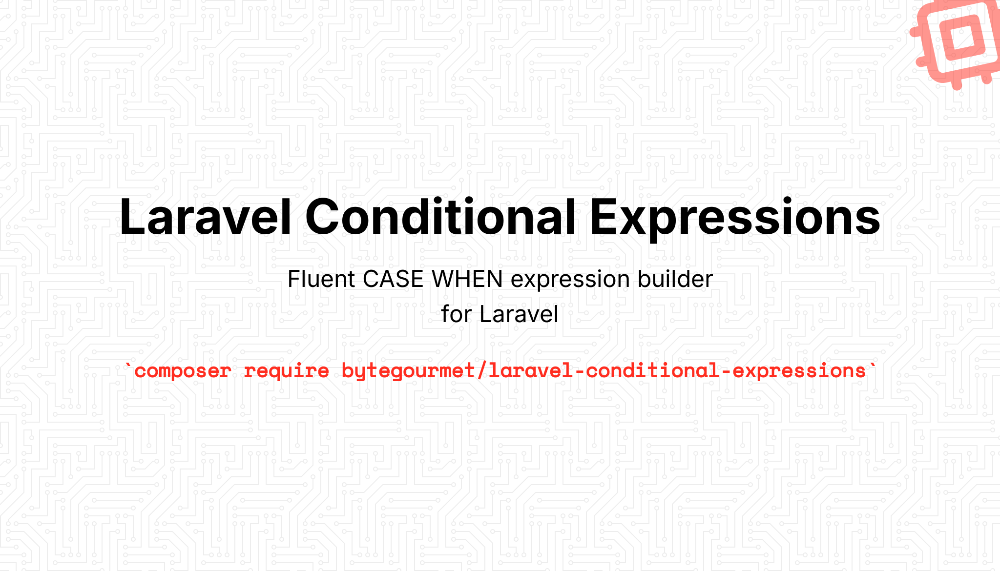

# Laravel Conditional Expressions

A fluent CASE WHEN expression builder for Laravel that makes it easy to write complex conditional SQL expressions in your queries.

## Features

- 🎯 **Fluent API** - Chain methods for readable CASE expressions
- 🔄 **Nested CASE** - Support for nested CASE expressions
- 🛠️ **Complex Conditions** - Use `CaseBuilder` for complex WHERE conditions
- 📦 **Laravel Integration** - Works seamlessly with Eloquent and Query Builder
- 🔒 **Parameter Binding** - Automatic parameter binding for security
- 🎨 **Simple & Searched CASE** - Support for both CASE types

## Requirements

- PHP >= 8.2
- Laravel >= 10.0

## Installation

### Standard Installation

Install the package via Composer:

```bash
composer require bytegourmet/laravel-conditional-expressions
```

The package will automatically register its service provider.

## Quick Start

### Basic Usage

```php
use ByteGourmet\LaravelConditionalExpressions\CaseExpr;

$users = User::query()
    ->select([
        'id',
        'name',
        CaseExpr::make()
            ->when('status', '=', 'active')
            ->then('Active User')
            ->when('status', '=', 'inactive')
            ->then('Inactive User')
            ->else('Unknown')
            ->as('status_label')
    ])
    ->get();
```

## Usage

### Simple CASE Expression

A simple CASE expression compares a column against multiple values:

```php
use ByteGourmet\LaravelConditionalExpressions\CaseExpr;

$case = CaseExpr::simple('status')
    ->when('active')
    ->then('User is active')
    ->when('inactive')
    ->then('User is inactive')
    ->else('Unknown status')
    ->as('status_description');

// Generates: CASE `status` WHEN 'active' THEN 'User is active' WHEN 'inactive' THEN 'User is inactive' ELSE 'Unknown status' END AS `status_description`
```

### Searched CASE Expression

A searched CASE expression evaluates conditions (no column comparison):

```php
use ByteGourmet\LaravelConditionalExpressions\CaseExpr;

$case = CaseExpr::make()
    ->when('age', '>=', 18)
    ->then('Adult')
    ->when('age', '>=', 13)
    ->then('Teenager')
    ->else('Child')
    ->as('age_category');

// Generates: CASE WHEN `age` >= ? THEN ? WHEN `age` >= ? THEN ? ELSE ? END AS `age_category`
```

### Using in Queries

#### With Eloquent Models

```php
use App\Models\User;
use ByteGourmet\LaravelConditionalExpressions\CaseExpr;

$users = User::query()
    ->select([
        'id',
        'name',
        'email',
        CaseExpr::make()
            ->when('email_verified_at', '!=', null)
            ->then('Verified')
            ->else('Unverified')
            ->as('verification_status')
    ])
    ->get();
```

#### With Query Builder

```php
use Illuminate\Support\Facades\DB;
use ByteGourmet\LaravelConditionalExpressions\CaseExpr;

$results = DB::table('orders')
    ->select([
        'id',
        'total',
        CaseExpr::make()
            ->when('total', '>', 1000)
            ->then('High Value')
            ->when('total', '>', 500)
            ->then('Medium Value')
            ->else('Low Value')
            ->as('order_category')
    ])
    ->get();
```

### Nested CASE Expressions

You can nest CASE expressions for complex logic:

```php
use ByteGourmet\LaravelConditionalExpressions\CaseExpr;

$case = CaseExpr::make()
    ->when('phone_verified', '=', true)
    ->then(
        CaseExpr::make()
            ->when('email_verified', '=', true)
            ->then('Fully Verified')
            ->else('Phone Verified Only')
    )
    ->else('Unverified')
    ->as('verification_status');
```

### Complex Conditions with CaseBuilder

For complex WHERE conditions in your CASE expressions, use `CaseBuilder`:

```php
use ByteGourmet\LaravelConditionalExpressions\CaseExpr;

$caseBuilder = CaseExpr::builder()
    ->where('status', 'active')
    ->where('email_verified_at', '!=', null)
    ->orWhere('phone_verified_at', '!=', null);

$case = CaseExpr::make()
    ->when($caseBuilder)
    ->then('Fully Verified')
    ->when('status', '=', 'pending')
    ->then('Pending Verification')
    ->else('Unverified')
    ->as('account_status');
```

#### Advanced CaseBuilder Usage

```php
use ByteGourmet\LaravelConditionalExpressions\CaseExpr;

$caseBuilder = CaseExpr::builder()
    ->where('a', 1)
    ->where('b', '>', 2)
    ->orWhere([
        'c' => 3,
        'd' => '4',
        ['e', '!=', 5],
    ])
    ->where(function ($query) {
        $query->whereNull('f');
    });

$case = CaseExpr::make()
    ->when($caseBuilder)
    ->then('Complex Condition Met')
    ->else('Condition Not Met')
    ->as('result');
```

### Using the selectCase Macro

The package provides a convenient `selectCase` macro for cleaner syntax:

```php
use App\Models\User;

$users = User::query()
    ->select(['id', 'name'])
    ->selectCase('status_label', function ($case) {
        $case
            ->when('status', '=', 'active')
            ->then('Active')
            ->when('status', '=', 'inactive')
            ->then('Inactive')
            ->else('Unknown');
    })
    ->get();
```

### Multiple CASE Expressions

You can use multiple CASE expressions in a single query:

```php
use ByteGourmet\LaravelConditionalExpressions\CaseExpr;

$users = User::query()
    ->select([
        'id',
        'name',
        CaseExpr::make()
            ->when('email_verified_at', '!=', null)
            ->then('Verified')
            ->else('Unverified')
            ->as('email_status'),
        CaseExpr::make()
            ->when('phone_verified_at', '!=', null)
            ->then('Verified')
            ->else('Unverified')
            ->as('phone_status'),
        CaseExpr::make()
            ->when('created_at', '>', now()->subDays(30))
            ->then('New User')
            ->else('Existing User')
            ->as('user_type')
    ])
    ->get();
```

### Real-World Examples

#### Example 1: User Status with Multiple Conditions

```php
use App\Models\User;
use ByteGourmet\LaravelConditionalExpressions\CaseExpr;

$users = User::query()
    ->select([
        'id',
        'name',
        CaseExpr::make()
            ->when('email_verified_at', '!=', null)
            ->then(
                CaseExpr::make()
                    ->when('phone_verified_at', '!=', null)
                    ->then('Fully Verified')
                    ->else('Email Verified Only')
            )
            ->when('phone_verified_at', '!=', null)
            ->then('Phone Verified Only')
            ->else('Unverified')
            ->as('verification_status')
    ])
    ->get();
```

#### Example 2: Order Priority Based on Amount and Date

```php
use Illuminate\Support\Facades\DB;
use ByteGourmet\LaravelConditionalExpressions\CaseExpr;

$orders = DB::table('orders')
    ->select([
        'id',
        'customer_id',
        'total',
        CaseExpr::make()
            ->when('total', '>', 1000)
            ->then('High Priority')
            ->when('total', '>', 500)
            ->then(
                CaseExpr::make()
                    ->when('created_at', '>', now()->subDays(7))
                    ->then('Medium Priority - Recent')
                    ->else('Medium Priority')
            )
            ->else('Low Priority')
            ->as('priority')
    ])
    ->get();
```

#### Example 3: Dynamic Pricing Tiers

```php
use App\Models\Product;
use ByteGourmet\LaravelConditionalExpressions\CaseExpr;

$products = Product::query()
    ->select([
        'id',
        'name',
        'price',
        CaseExpr::make()
            ->when('price', '>=', 1000)
            ->then('Premium')
            ->when('price', '>=', 500)
            ->then('Standard')
            ->when('price', '>=', 100)
            ->then('Basic')
            ->else('Economy')
            ->as('tier')
    ])
    ->get();
```

## API Reference

### CaseExpr

The main facade class for creating CASE expressions.

#### Methods

##### `CaseExpr::make(?string $column = null)`

Creates a new searched CASE expression (or simple CASE if column is provided).

```php
$case = CaseExpr::make(); // Searched CASE
$case = CaseExpr::make('status'); // Simple CASE
```

##### `CaseExpr::simple(string $column)`

Creates a simple CASE expression for the given column.

```php
$case = CaseExpr::simple('status');
```

##### `CaseExpr::builder()`

Creates a new `CaseBuilder` instance for complex conditions.

```php
$builder = CaseExpr::builder();
```

### CaseExpression

The expression class that builds the CASE statement.

#### Methods

##### `when(string|CaseBuilder|Expression $column, ?string $operator = null, mixed $value = null)`

Adds a WHEN clause to the CASE expression.

```php
$case->when('status', '=', 'active');
$case->when($caseBuilder); // Using CaseBuilder
```

##### `then(mixed $result)`

Sets the THEN value for the last WHEN clause. Accepts scalar values or nested `CaseExpression`.

```php
$case->then('Active');
$case->then(CaseExpr::make()->when(...)->then(...)); // Nested
```

##### `else(mixed $result)`

Sets the ELSE value. Accepts scalar values or nested `CaseExpression`.

```php
$case->else('Unknown');
```

##### `as(string $alias)`

Sets an alias for the CASE expression.

```php
$case->as('status_label');
```

##### `toSql()`

Returns the generated SQL string.

```php
$sql = $case->toSql();
```

##### `getBindings()`

Returns the parameter bindings array.

```php
$bindings = $case->getBindings();
```

### CaseBuilder

Extends Laravel's Query Builder for building complex WHERE conditions.

#### Methods

##### `CaseBuilder::query()`

Creates a new CaseBuilder instance.

```php
$builder = CaseExpr::builder();
```

##### `getConditions()`

Returns the compiled WHERE conditions as a string.

```php
$conditions = $builder->getConditions();
```

All standard Laravel Query Builder methods are available (`where`, `orWhere`, `whereNull`, etc.).

## Debugging

You can debug your CASE expressions using the provided helper methods:

```php
$case = CaseExpr::make()
    ->when('status', '=', 'active')
    ->then('Active')
    ->else('Inactive');

// Dump the SQL
$case->dump();

// Dump and die
$case->dd();
```

## Testing

Run the test suite:

```bash
composer test
```

## Contributing

Contributions are welcome! Please feel free to submit a Pull Request.

## License

This package is open-sourced software licensed under the [MIT license](LICENSE.md).

## Credits

- **Author**: Riju Ghosh
